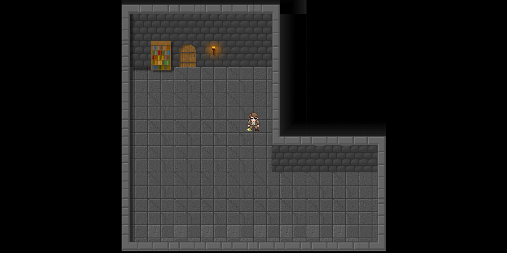

# LiveToSurvive - OpenGL 2D Tile-based Game

## Overview

**LiveToSurvive** is a 2D tile-based game built using modern OpenGL (4.6) in C++.  
This project demonstrates fundamental graphics programming concepts, including:

- **OpenGL abstractions**: VAO, VBO, shader management, and texture management
- **Player controller**: A dedicated player class with movement handling
- **Tilemap system**: Dynamic loading and rendering of tile-based maps
- **Efficient render loop**: Utilizing modern graphics APIs for performance

---

## Features

✅ Custom shader management for dynamic rendering  
✅ Texture loading with **stb_image**  
✅ CSV-based tile map data loading  
✅ Modular structure for easy extension  
✅ Basic game loop: update, render, and input handling  
✅ Orthographic projection for 2D rendering

---

## Dependencies

- **GLFW** for windowing and input  
- **GLAD** for OpenGL function loading  
- **stb_image** for texture loading  
- **GLM** for mathematics (matrices, vectors)

